# Star Trek Quiz README

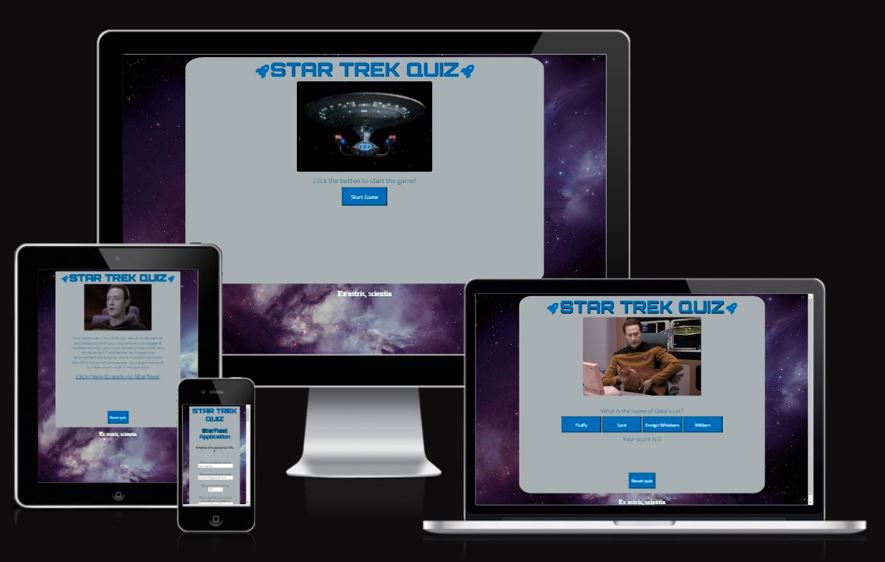

The following read me file seeks to summarize the intent and implementation of the Star Trek Quiz page. It will describe user experience, features, visual design, technologies, validation + testing and acknowledgements

The respository on GitHub can be accessed from this link
https://github.com/gazamcnulty/quiz-practice

The live website can be accessed from this link
https://gazamcnulty.github.io/quiz-practice/

## Table of Contents:

- Introduction and Summary 
- Intent 
- User Experience and User Stories 
- Features and Visual Design 
- Wireframes
- Technologies 
- Validation and Testing 
- Known bugs and issues
- Acknowledgements and Credits 

## Introduction and summary

The Star Trek Quiz is a site that has a short quiz and application, it is for entertainment purposes for Star Trek fans. Its practical application would be ideal for a Star Trek fan community website, or a post on a fan page on social media like Facebook or Instagram. The site is targeted at fans of the television show Star Trek : The Next Generation. It contains a simple 10 question quiz based on the show. 

Each question has 4 possible answers, a relevant image. If the correct answer is selected, the user score is increased by 1. If the wrong answer is selected, there is no change to the score. In either case, there is a button to proceed to the next question and also a reset button to begin the quiz again. After 10 questions have been answered, the page presents the final score and a celebratory image. 

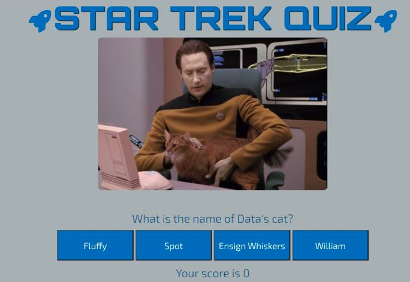

After the quiz has been completed , there is a bonus section, whereby a button can be pressed which provides detailed info about the user score. Depending on how good the score was this will present different text and image, the higher the score the better the rank. After this has been presented there is an additional button that leads to a form page for a Starfleet application.

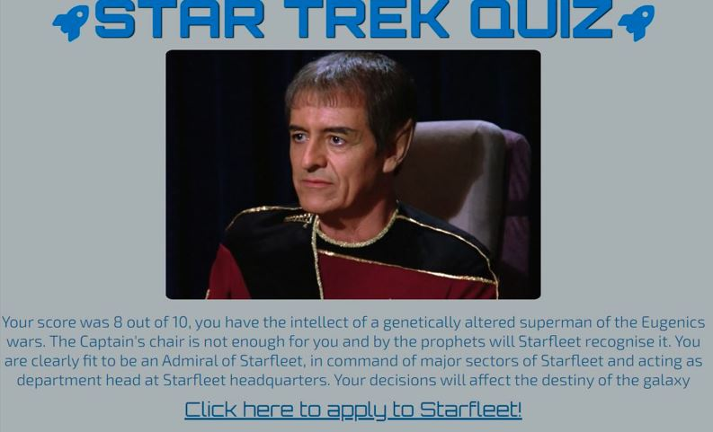

The Starfleet application is for entertainment purposes similar to the quiz, it is a service application to the fictional entity Starfleet. It asks the user for various personal info as if they were applying to an academy or military. It also contains a section for non-humans / aliens. It asks for a short paragraph as to why the user wants to join Starfleet. In the questions and closing paragraph, it provides lore on the fictional Star Trek universe. This allows immersion and the user to 'roleplay' as a potential cadet of Starfleet.

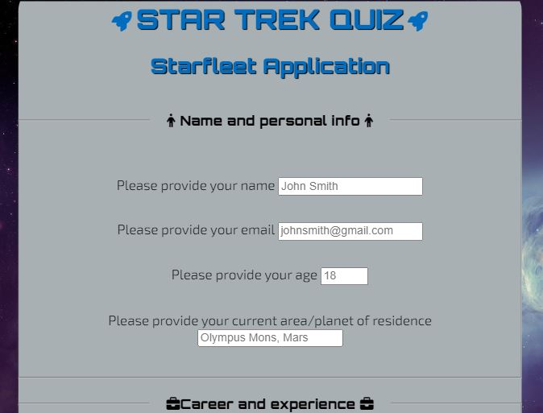

## Intent

My intent here is to provide content for Star Trek fans. It should be something fun to stumble upon as a Star Trek fan, it should be entertaining as a quiz and intriguing in a way that makes the user more curious about Star Trek. I would hope that they will share the page with friends and members of the Star Trek community, which will cause them to discuss the quiz, the lore of Star Trek and points brought up in the quiz questions. 

Users will be given a score which they could compare with friends and lead to further discussions. I hope even non fans may find it and be curious enough to try the quiz for fun. I hope that someone will be curious to google something from the site, which could lead them to a wiki page or trivia page or other Star Trek fan communities. 
At the end of the day , the real intent of this page is to keep the Star Trek discourse going and generate interest + curiosity in Star Trek and science fiction.

## User-experience/User-stories

**New users :** 
I want new users to find the website amusing and entertaining. It should be novelty to find a simple 10 question Star Trek quiz which tests their knowledge of the lore. It will be a surprise that it goes beyond the trivia questions and presents additional feedback based on their score. The recommendation to apply and the Starfleet application should make the user feel immersed and entertained. The user should want to share the page with their friends who are also Star Trek fans , so they can compare scores and discuss the show.

New user story
*"I was bored the other day and went on to my favorite Star Trek fan page on Facebook. I noticed they had shared a link to a Star Trek quiz and people were commenting on it comparing scores. Being a well versed fan, I thought I should give it a go. The page was fairly simple, it didn't have a lot of bells and whistles and let me get straight into the quiz. Each question had 4 possible answers and a picture of the character or topic. After choosing an answer, it told me if it was correct or not and then presented a new button so I could go to the next question. I honestly thought it was pretty easy and I got an 8/10. What surprised me was that it gave me feedback on my score as if I was a prospective applicant to Starfleet. I got an 8/10 so it gave me the rank of captain! Finally it presented a button to apply to Starfleet, when I clicked the link it brought up a full application page. It was funny and unexpected, I felt as if I was filling out a real application to Starfleet. I went back to the Facebook page and commented on my score and rank, a few people replied back to me with theirs and we got to talking about Star Trek. It was just a short silly quiz but I enjoy any opportunity to talk about Star Trek."*

**Return users:**
I want return users to remember exactly how the site works so they can jump straight back into the quiz if they want to. The quiz contains reset buttons on every page so they can always reset if they want to try to get a perfect score. Realistically, I don't expect too many return users outside of a few specific scenarios : users replaying for a perfect score, users opening the page themselves to show or share with friends, or Star Trek content creators who are also looking to create a Star Trek quiz/game ( they may look at this one as a frame of comparison)

Return user story
*"I remembered the Star Trek quiz that I had taken last week. It was a short simple quiz with a surprising bit of lore and a Starfleet application at the end. It had led to me discussing the quiz with other Star Trek fans online and I actually added a couple of them as Facebook friends. I was glad it had given me the excuse to chat about Star Trek with some new friends. I remembered I had gotten an 8/10 so I decided to go back to the website to see if I could get a perfect score. I had been given the rank of 'Captain' for my 8/10 , so I was curious to see what the rank would be if I got a 10/10 - I was similarly curious to see what would happen for low scores. I played it again from start to finish and got another 8/10. This time I didn't proceed to the application, instead I reset the game and tried again. After a few attempts I got a perfect score. Lucky for me there was a reset button on the page , so whenever I got one wrong I could hit reset to start again. I was surprised and delighted I got the rank of 'Q', this is a fictional character in the show who is omnipotent and omniscient, the feedback on the rank was almost a bit meta. I was pleased with this and decided to share my score again on Facebook. A few of the users on the Star Trek fan page commented back and I added them as Facebook friends. I challenged them to see if they could match my perfect score."*

**Frequent users:**
I want frequent users to be able to navigate the page quickly and efficiently. It is not overly complex so I feel like a frequent user will know exactly how the quiz works. Similarly I don't really expect people to frequent the site. If however I am able to implement random questions ( as opposed to the same fixed 10 questions) this could create a cause for users to frequent the page every now and then.

I don't have an idea for frequent user stories at this time, but it is something I will come back to with future updates to this page. If it becomes more complex with more questions and replayability, there will be some consideration for frequent user stories

## FEATURES

**Overall structure**
The Star Trek Quiz site consists of just two pages, index.html and application.html. Most of the features and interaction will take place on index.html, with different elements and features being swapped in and out by javascript functions. application.html is a separate web page containing a form. While it may have been possible to have more pages, maybe even a different page for each of the 10 trivia questions, I chose to just use one or two for this project. Mainly because the purpose of the project is to test the newly learned javascript. Similar to the lovemaths example, javascript can be used to remove and add content to a html page. So instead of having loads of different pages, I can just have one or two html pages and let the javascript change it as needed. 
I could have extended this as far as just having one page and letting the javascript replace all of the quiz content with the application, however I don't think this would be best practice for a real world website. The index.html is all about the trivia questions , so the appearance and format is mostly unchanged. This makes it easier for the javascript to use the existing framework in the html and insert or remove content as needed. But the form is a completely different structure so it would not have been as clean using the javascript to replace the quiz questions with a form. Keeping it on a seperate page also makes it easier to locate bugs or change the html. I believe it is also a better user experience to 'leave' the quiz page and go to a brand new webpage with a different structure.

**index.html**

The first thing that is visible is the header at the top of the page, with the words STAR TREK QUIZ . It is in big bold letters at the top of the page, so the user will immediately know the purpose of the page. The header is also a link, so if they click on the title it will bring them back to the landing page and reset the quiz. There will also be a reset button that serves the same function, however this is good UX as some users if confused or looking to get back to the start will try to click on the main header at the top of the page. This ensures that no matter where the user is in the quiz or application, they can click the title at the top to reset the quiz. 

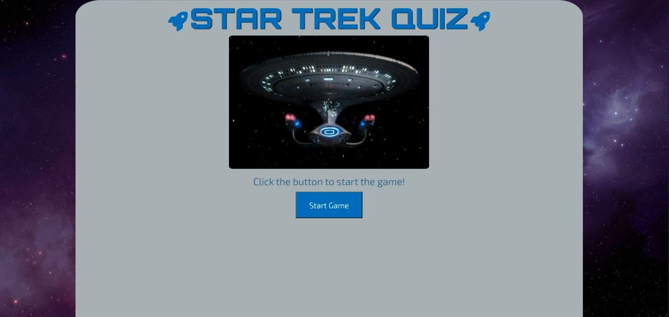

Below the header is a small image of the Starship Enterprise-D. This is an iconic ship and immediately recognisable to anyone with a passing knowledge of Star Trek. It communicates non-verbally that this page is based on Star Trek. This means that even at a glance a Star Trek fan may be intrigued and curious as to what the page contains.
Below the image is a line of text and button, which both invite the user to click and begin the quiz. There isn't anything else too distracting at this stage, so it immediately funnels the user into starting the quiz. This is important for user experience , they don't become overwhelmed or apathetic to too many features or distractions on the page ; instead it's a simple invitation saying "Hey this is a simple Star Trek quiz, wanna play?" I feel that the simpler more utilitarian design is more likely to draw users in, than overly distracting and ostentatious features/design.

Aside from these features, the main body of the quiz will be on a mid-sized white/grey base, this ensures good readability and accessibility for users. This base will then be on a background which shows a dark image of space/stars. The contrast between the white/grey base which is sitting on the dark space background will immediately communicate to the user where the main part of the page and quiz is, it also provides a little three dimensional appearance and makes it slightly more visually interesting than a plain monochrome background.

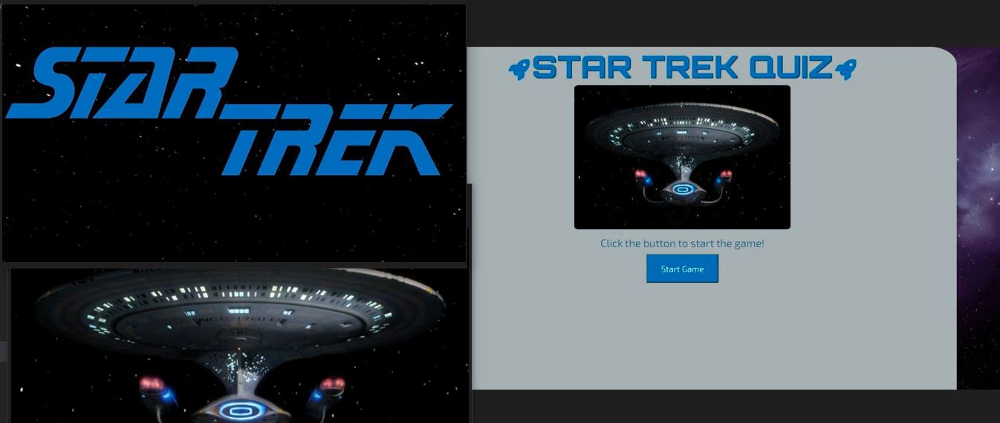

Finally, at the very bottom of the page is a motto , a latin phrase stating "Ex astris, scientia" This is the motto of Starfleet Academy , the fictional training academy for cadets who wish to enlist in Starfleet. Translated from Latin, it means 'from the stars, knowledge' . This doesn't really add a whole lot in terms of the quiz or interactivity, it is just a bit more lore for fans of Star Trek. It is located at the bottom of the page, under the base, so it is not immediately viewable to users. This is important so that it does not distract from the quiz. It is an optional detail or easter egg that a user may find if they are curious enough to scroll to the bottom of the page. I would hope that the person finding it would google the phrase "Ex astris, scientia", which will then bring up a list of links relating to Star Trek and Starfleet Academy and wiki pages about Star Trek

Upon clicking the button to start the quiz, the content of the page will change slightly, though the structure and locations remain mostly the same. The image of the Enterprise-D changes to a new image, of the same size and location. This new image will feature a character from the tv show, in a particular act or scenario which is relevant to the question. (For example, the question asks what is the name of Data's cat, then the image shows the character Data holding his cat)
Under the image, the line of text has been replaced with a question. Under the question are 4 buttons, each is a possible answer to the question. Lower down below these answers, there is another button which says 'click here to reset the game'. These features are fairly self explanatory , so I expect any user to immediately understand the format of the quiz. The reset button allows for better user experience, in that if they want to start again they can immediately reset, without having to close the page and reopen or refresh the browser.

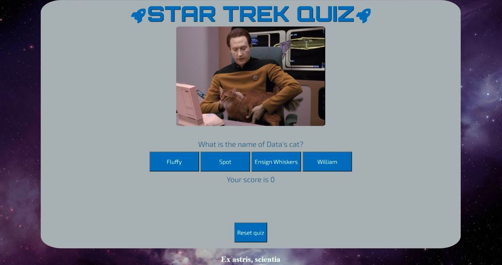

Each time the user selects an answer by clicking the button, a line of text pops up advising whether this was right or wrong. Another button then pops up letting the user move to the next question. This structure continues until 10 questions have been answered.

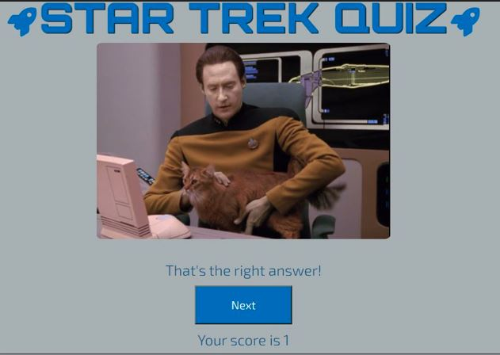

Finally after answering 10 questions the image changes to a character celebrating and the line of text thanks the user for playing. At this stage the quiz has completed its primary goal in providing entertainment to the user , but there are additional bonus features available also if the user wishes to continue. Another button pops up, this one says 'is Starfleet the career for you?'

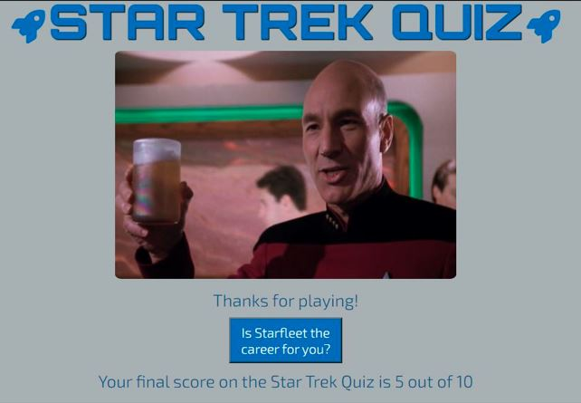

Upon clicking that button , the website provides feedback on the user's score. Depending on how highly they scored it will provide a paragraph of text , suggesting how much of an aptitude they have for Starfleet service and suggest the type of rank that they may aspire to , based on the score. Higher scores mean higher ranks, each score from 0 out of 10 to 10 out of 10 has a different rank and text content. The image is also dependent on the score. This provides additional feedback and entertainment to the user, and it has some lore about the show. It may also motivate the user to reset the quiz and try again for a higher score. Finally the button is replaced with a link asking the user to enlist in Starfleet. This takes the user to a different web page, away from index.html to application.html

**application.html**
The Starfleet application is for entertainment purposes similar to the quiz, it is a service application to the fictional entity Starfleet. It asks the user for various personal info as if they were applying to an academy or military. It also contains a section for non-humans / aliens. It asks for a short paragraph as to why the user wants to join Starfleet. In the questions and closing paragraph, it provides lore on the fictional Star Trek universe. This allows immersion and the user to 'roleplay' as a potential cadet of Starfleet.

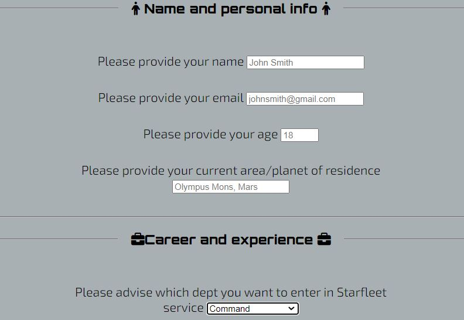
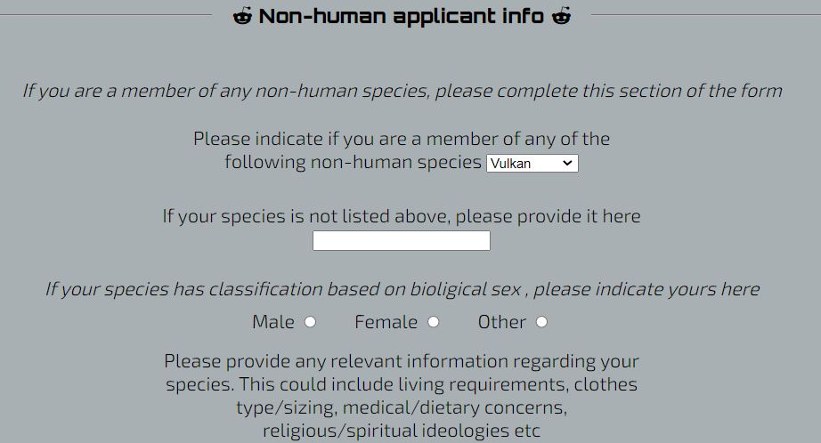
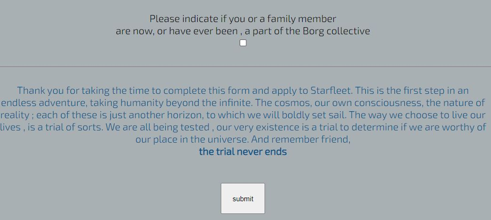

## VISUAL DESIGN
I wanted to use simple non distracting visual design that fit the visual style of the television show and also made the elements easily discernible to any user. Most ships in Star Trek are grey colored, in The Next Generation the usual color scheme is a bit bland with muted 'hotel' style color tones. I decided to use a simple grey base for the quiz and use a high definition image of space for the background behind it.

I used a  [Image Color Picker](https://imagecolorpicker.com/env) to compare colors from an image from the television show. This provided source colors for the grey background(from the ship) and the blue font (from the tv show title card). I used the palette provided to choose similar colors, that invoked the look of the show while also being readable and suited to the function of the quiz.

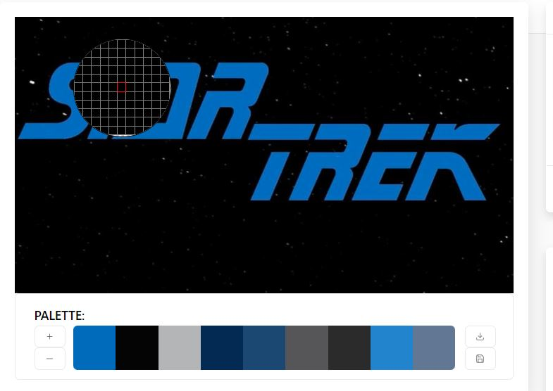

The main header of the page is a h1 element and has large em sizing, to denote its importance semantically to someone looking at the code and visually to a standard user. The font used was 'Omicron' along with some standard fonts as backup. This is a cool font which isn't too far off of something that would be used on Star Trek. It is stylised enough to be interesting to the user , it looks different from most fonts one would typically see. This makes it more engaging and more likely to draw someone in out of curiosity.

I added some simple icons using  [fontawesome](https://fontawesome.com/icons ) , a space/rocket ship next to the header and smaller relevant icons to the different sections of the application form (person for personal details, checklist for Ts and Cs etc) This don't change the overall design a whole lot but it provides some additional non-verbal communication which is always good for user experience and general accessibility.

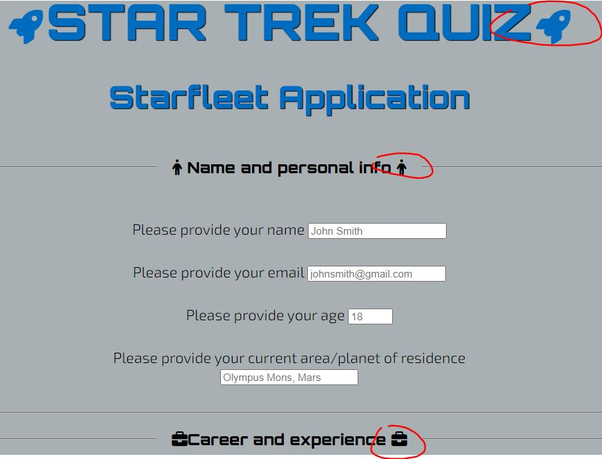

The background image is a hd spacewallpaper, it was uploaded onto reddit.com by user u/amodep1, on the subreddit [r/ultrahdwallpapers](https://www.reddit.com/r/ultrahdwallpapers/comments/86hp1i/galaxy_nebula_blurring_stars_3840x2160/ )  .  I had originally used pexels, but I was unable to locate an image of space that was HD enough for my goal. I wanted the image to look good both on a standard monitor or a larger 4k monitor and I am satisfied with this background.

The images have a uniform size, this is because I wanted to try to reduce elements moving or changing position between questions. This does still occur slightly , but the images remaining the same size helps reduce it significantly. Each image is a screenshot I took myself, using a snipping tool from footage of episodes of Star Trek The Next Generation.

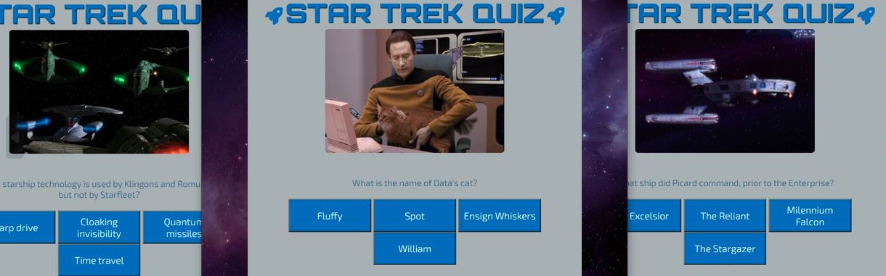

The buttons have a uniform size and are large. This is to make it very obvious to the user that they are clickable buttons. I gave them a background color which matches the same color of the header, so keep the visual design consistent. I gave the text a white color as I feel this contrasts well with the blue color. The 4 answer buttons are on a horizontal line all next to each other , so it's quite obvious they are related to one another. On different screen sizes they can change from 4 on one line, to 3 x 1 or, 2 x 2. However they are always layed out symetrically so it is always clear they are related in function.

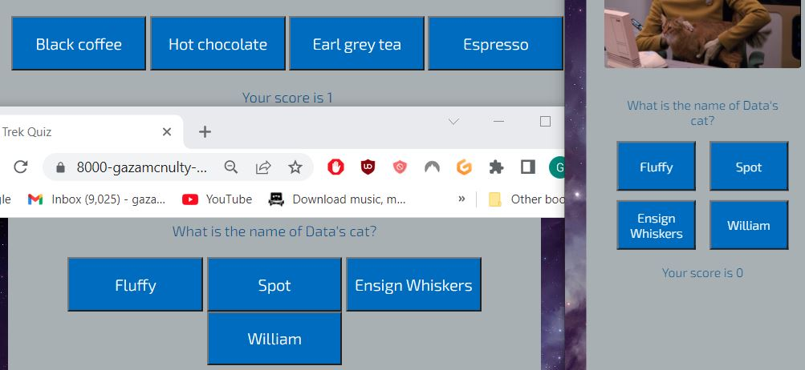

Above the answer buttons, I have some text which asks the trivia question. This is using font Exo2 , with more standard fonts as backup. Exo2 is another 'sci-fi' style font, but it is a bit more readable than the more exotic Orbitron font used in the header. I wanted these to look normal enough compared to some of the other stylised elements, so the user can just focus on the content of the question rather than the visual design.

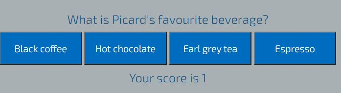

The question is always visible at the same time as the answer buttons, though once it is pressed the content changes. The question line is replaced with another line of text which advises whether the answer was right or wrong. The answer buttons is replaced by a single 'next' button which allows the user to proceed to the next question. My reason for this was to prevent the user from seeing the question + answer buttons after they had chosen an answer. I wanted them to be able to proceed straight to the next question without dwelling too much on the previous one. However I also didn't want to force them through immediately -  I wanted to give them the opportunity to reflect for a moment on the success/failure of the attempt, and then they can proceed to the next question when they are ready. This has a secondary purpose of preventing the user from selecting the same answer multiple times.
 I thought about having more urgent elements , like a countdown timer or quick change but I decided not to. I want this to be fun , chill quiz not an urgent race against time.

 

Under the answer buttons and next button, there is a line of text providing the user score. This counts how many correct answers the user got and displays them here. I thought about adding some more complex visual elements such as a progress bar or color to indicate how well or badly they are doing - but again I felt this went against the ethos of the page . It's just a fun quiz about star trek , the real intent is to generate interest and input from Star Trek fans, to cause them to share and discuss with their friends. I don't want people to feel bad or feel under pressure about how badly or well they are doing in the quiz.

Under the grey 'base' there is a small almost hidden line of text 'Ex astris, scientia' As I mentioned above, this is the motto of Starfleet academy and it's just a bit of extra lore for fans. I gave this a simple white color to contrast against its dark background image of space.

At the end of the quiz the question line is replaced by a celebratory thank you, the button is replaced with a new button which asks 'Is Starfleet the career for you'? It has a similar appearance to the other buttons but the content is so different from what one may expect on a quiz , I am hoping users will be curious enough to click on it. This replaces the quiz with a paragraph of text , dependent on how well the user did. A link is then presented which leads to application.html

The application form keeps the same visual scheme as the quiz, this keeps the visual design consistent. The main difference is that the majority of form text elements are in black instead of previously used blue. I felt this was more appropriate to lend a vibe of 'seriousness' to the form. After all it was a serious application form to starfleet, this is closer to how it would look. This is more engaging for fans and easier for legibility purposes also. 

There are small font awesome icons included on the legend of each form section, just for further clarity on the meaning of each section.

 The final paragraph at the bottom does go back to using a blue color, this is because at this stage you are pretty much done with filling out the form and it's just providing some lore and flavor text again. As it's all about Star Trek and Starfleet I wanted to subconsciously bring the user back to the Star Trek mindset by using a similar color to what would have been used in the title card on The Next Generation tv show.

 

The submit button at the very bottom is unstylized, I thought about making its appearance similar to the other buttons but here , the white background matches the input sections of the form so it is consistent for the application page.

## Wireframes

- Homescreen desktop 

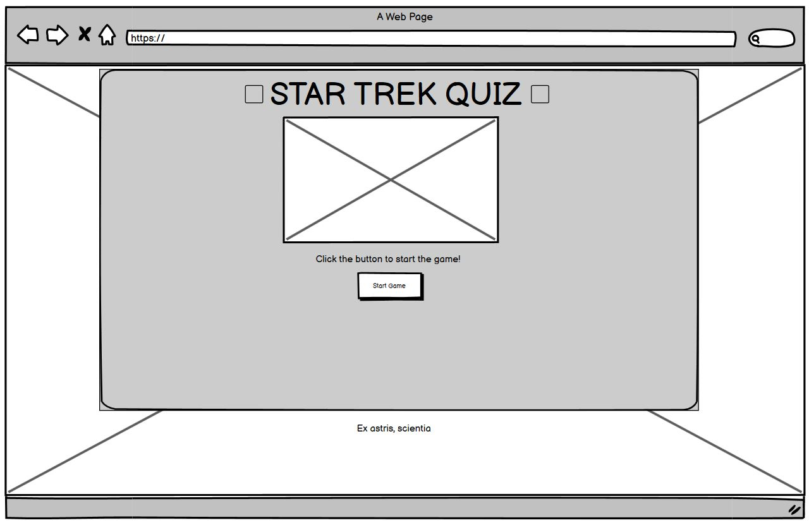

- Homescreen mobile 

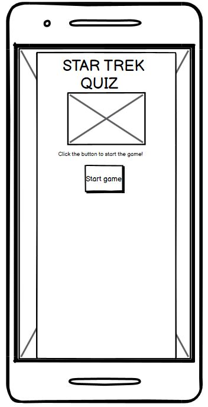

- Question 1 desktop

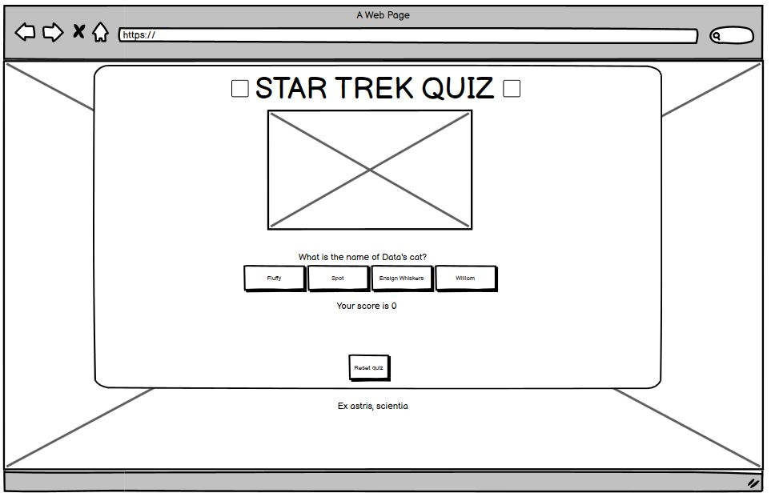

- Question 1 

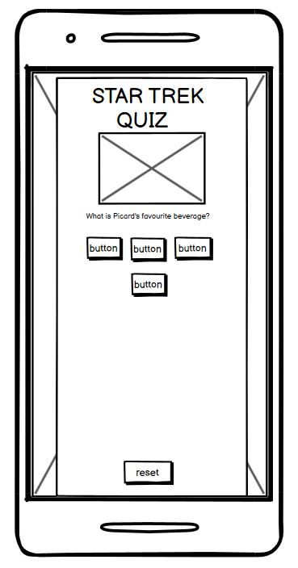

- Final results desktop

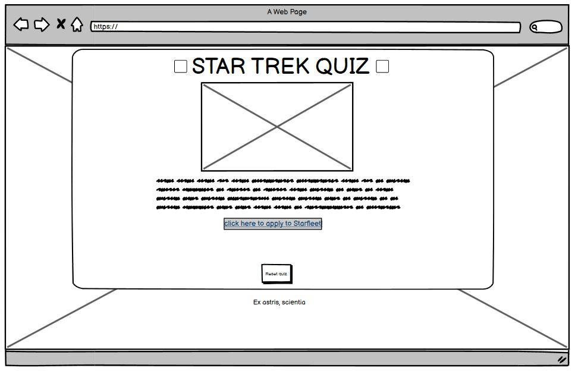

- Final results mobile

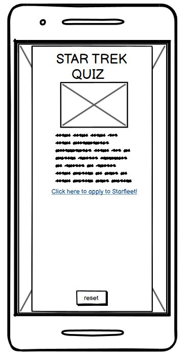

- Form desktop

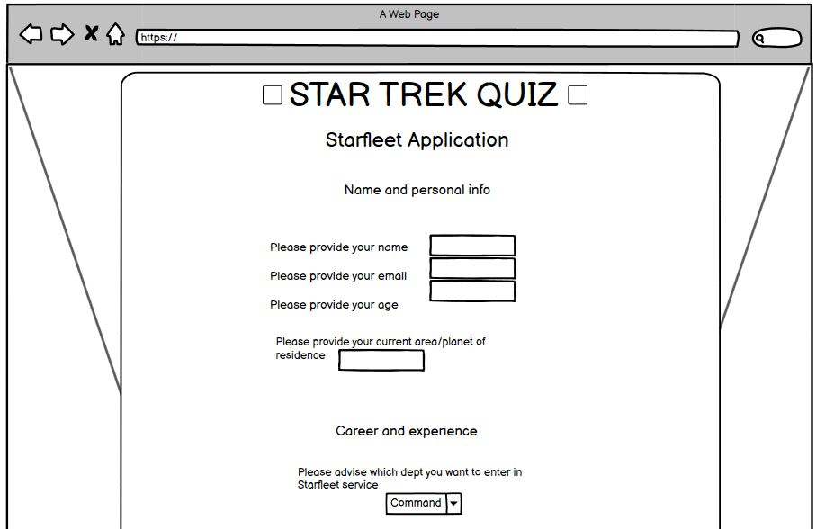

- Form mobile 

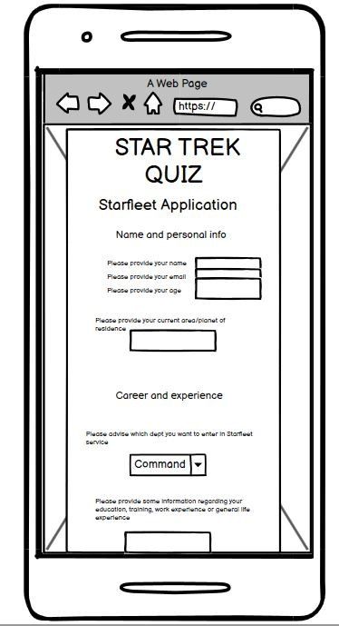

## Future Updates / Places to improve

I would like the questions to be chosen at random from a very large pool of possible questions. I would do this by increasing the questions from 10 to a much higher number, and then have them be selected by a random number generator. This version of the quiz would ask a random set of questions each time a user started the game. This would vastly increase replay value, not just from having more content but also it being more difficult to get a higher rank. This could be implemented by using Math.random method, multiplying by a number and assigning this value to variable, which is then used as the index to source a question + answers

I would like to maybe transform the Starfleet application page, from a functional application form to a real life sign up form for a fanclub/ website. It could be a combination of fictional questions ( are you an alien ) and real world info ( email , friend requests, school etc) For instance if this quiz was being used on a star trek fan site, instead of it just being a fun role playing exercise, the application could be meta textual and ask for real world details, which would enable the user to create a profile or login. ( if this was to be implemented it would need to remove some of the questions such as medical info etc. while this is fun as a role playing exercise in the fictional star trek universe, if you are signing up for a real world website it would be inappropriate to ask for this info )

I would like to put in more extra content similar to the application form , like an easter egg. I would like to maybe have a random chance that a small ship can spawn in the corner of the page while taking the quiz, if the user notices this and clicks on the ship it could trigger some bonus content like a second quiz with a different visual style (eg you have been captured by klingons and you must answer these questions to prove your honor etc). Although the application form was not really related to the javascript per the goals of this project, I enjoyed adding it as bonus content. This is the kind of thing I would like to expand on in this website.

I would like to optimize my javascript code , to reduce instances of repeated code where unnecessary. For example, instead of using multiple functions interacting together, I may have been able to incorporate them into one 'do/while' loop. That being said, my understanding of the lessons and recommendations is that, it can be good to 'play it safe' with multiple smaller functions, which makes it easier to debug etc. Nevertheless I will consider ways of streamlining or improving the script. 
Another example is in the image arrays I have each index as inner html , with the img tag src attribute containing the file path to the images folder. There is room for optimization here, where there is just one instance of innerHTML with the same image tag and src attribute, but the final image name is a variable which can be iterated through or called on. I will reexamine this page in the future as I would like to expand on , add more complex code and optimize it as much as possible. 

## Technologies
Languages: -HTML5 -CSS -javascript

- GitHub was used to create and hold the repository of code.
- Git was used to control the terminal, add , commit and push to GitHub
- GitPod was used for the coding environment, based on Visual Studio Code
- Google Fonts was used to import fonts 'Orbitron', 'Exo2', 
- Font Awesome was used to import icons
- Balsamiq was used to generate wireframes

## Creation and Deployment

**creation / template**
The code was created from the Code-Institute-Org/gitpod-full-template on GitHub. [Code Institute Template on GitHub](https://github.com/Code-Institute-Org/gitpod-full-template) This was accessed by clicking on 'use this template' , choosing a name , description. After this I clicked create repository. Clicked Gitpod , this created a new workspace for me to use in Gitpod , along with tools provided by Code Institute

**deployment**
On my GitHub page, I can access my repositories. The repository for this particular project is located here.
From here you can click on 'Settings' , then on the left side click on 'Pages'
Click on 'Sources' , click 'Master Branch' 
From the source section drop-down menu, select the Master Branch
This will cause the page will be to refresh and show confirmation that indicates successful deployment
It provides a link that can now be used to view the website externally, any pushed changes will now feed through to this page.

see here for further info on deployment/ publishing https://docs.github.com/en/pages/getting-started-with-github-pages/configuring-a-publishing-source-for-your-github-pages-site

**cloning the repository**
on the main repository page, click code, then copy the url. If on windows, you need to use Command Line with git bash to move it to the local directory. This can be done with the Terminal on Mac. In whichever tool,  type "git clone" into the command line then paste in the copied url and press the Enter key to clone the repository

see here for further info on cloning a repository https://docs.github.com/en/repositories/creating-and-managing-repositories/cloning-a-repository

**fork the repository**
 go to the main repository page, then at the top click on 'fork' . Select an owner fo the new fork (this would be your own github username). select the name for the new fork per github *"forks are named the same as their upstream repositories. You can change the name of the fork to distinguish it further.* add a description . choose to copy defaul or all branches. as standard, only the default is needed. click 'create fork' to complete the fork process

see here for further info on forking https://docs.github.com/en/get-started/quickstart/fork-a-repo

## Validation and testing

- validation 
The W3C html Validator was used to validate and check for errors in the html code. Upon completion, it found no errors in index.html, application.html

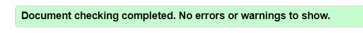

The W3C css Validator was used to validate and check for errors in the css code. Upon completion, it found no errors in style.css.

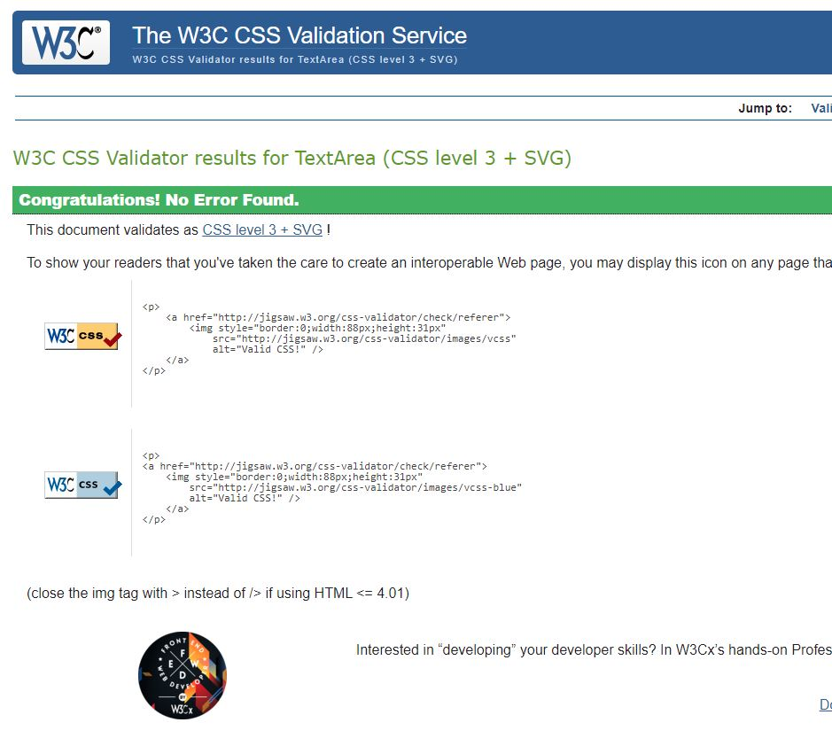

CodeBeautify Javascript Validator + jshint.com were used to validate and check for errors in the javascript code. Upon completion, they both warned of an issue with 4 named variables, being unused.

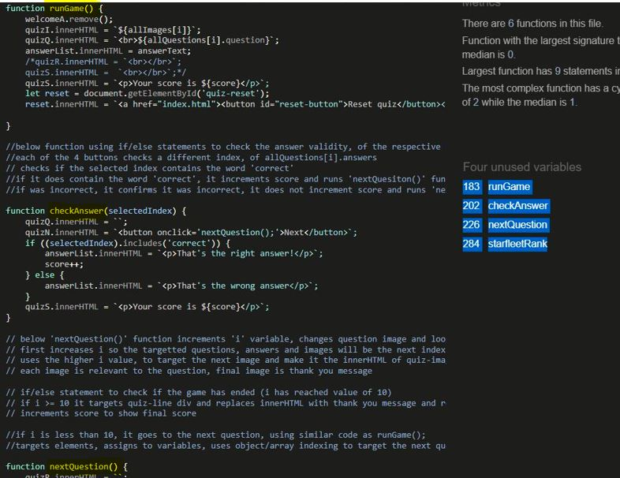
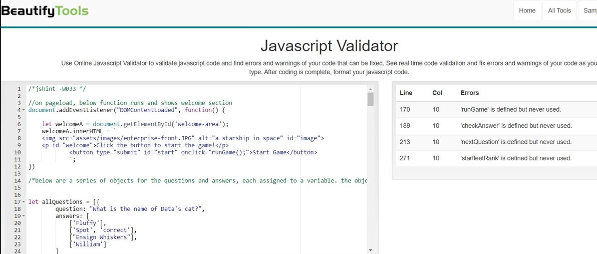

 These variables refer to 4 functions, runGame(), checkAnswer(), nextQuestion(), starfleetRank(). I have done some investigation into this, I have found that some users will use js comments such as /* jshint unused:vars */ or /*jshint unused: false*/ to force jshint to ignore this error. See below discussion on stackoverflow
https://stackoverflow.com/questions/30673360/prevent-jshint-from-reporting-that-a-variable-is-unused-for-specific-local-varia

Similarly , other Code Institute users have encountered the issue and ignored it. In this instance I am logging a record of the bug for future reference. I will come back to this another time to see if there is a way to better optimize the javascript code to prevent this bug.

**format / beautify**

[Code Beautify](https://codebeautify.org/htmlviewer) was used to beautify / format the html code 

[Dan's Tools CSS Formatter ](https://www.cleancss.com/css-beautify/) was used to beautify / format the css code 

[CodeBeautify Javascript Validator ](https://codebeautify.org/jsvalidate) was used to beautify / format the javascript code 

**browser testing**

The website was tested by pasting the external https link https://gazamcnulty.github.io/quiz-practice/ to the following browsers
Chrome presented no issues.
Edge presented no issues.
Safari presented no issues.
Firefox has slightly changed the appearance of the legend element in application.html.  It orients the legend-text to the left of the fieldset, instead of being centered like in chrome. This is a known issue with firefox affecting legend elements. While it is a visual variant I don't consider it a bug requiring correction. In future incarnations I would look into using firefox targetting css to change the appearance in that browser.

**scenario testing**
I tested various scenarios on the web page, to see if I could discover any bugs, errors or visual issues. As this is a relatively simple quiz as opposed to a complex website, there aren't too many variables for a user to affect but I tested as much as possible to be safe.

- Checking links 
I clicked all links , including the header link from index.html , the application link at the end of the quiz on index.html and the header link from application.html. They all result in the quiz being reset back on the homescreen , as intended.

- Checking buttons 
I clicked on all buttons , including start game, next question, reset button, is starfleet the career for you, and all of the answer buttons on index.html. Start game succesfully triggers the first quiz question. Next question succesfully moves user from result of current question to the next question. Reset question resets the quiz and brings user back to the home page, same as header link. Is starfleet the career for you shows user the endgame and gives a paragraph based on users final score, as intended. Submit button on application.html succesfully submits the form info via https://formdump.codeinstitute.net/ 

- Checking form
The form lets me succesfully submit the info while pressing the submit button if I have put info in all of the categories / input elements. it 
submits the form info via https://formdump.codeinstitute.net/  
The form will not let me submit if I do not complete the 'required' parts of the form, which is name, email, age , address and terms + conditions. This is intended as I wanted some information to be a requirement.
The form will let me submit if I only complete the 'required' parts of the form, it will submit if none / some / or all other parts are completed or empty. This is intended

- Checking visuals , navigation , readability
I have checked over all parts of the quiz and I find the imagery and text to be clearly readable. Navigation is very straight forward, you can't get 'lost' as its essentially one direction. The only way to deviate from navigation is if you click the link or button to reset, which just lets you start again. I find the backgrounds and color usage to not be distracting from the primary content of the quiz page.

- Checking responsiveness
I have checked the responsiveness of various simulated screensizes, per developer tools. I have checked in standard desktop monitor size, smartphones like Samsung Galaxy 8 , Samsung Fold, iphone SE , iphone XR , ipad , 
Across all the variants of height and width, the only issues with elements overlapping / not looking correct occurs at very small sizes such as width 275px. The closest to this is Samsung Galaxy Fold device with a width of 280px and it appears fine on that screen, no overlap.
I have placed media queries to compensate for small screens and large monitors up to 4k resolution. I have tested across all of these and found no issues with presentation or function of the website.

## Known bugs and issues

## Acknowledgements and credits

Star Trek is a fictional television show and movie franchise, all related copyrights and trademarks are owned by CBS and Paramount

All images used of Star Trek characters have been screenshots, taken by myself from episodes of Star Trek: The Next Generation

Elements of Starfleet survey were taken from another html project of which is my own work/code. This was a project I did last year for the online course 'Responsive Web Design Certification' on the website freeCodeCamp 
 This page was not uploaded onto github, it doesn't exist as a publicly accessible web page, however I wanted to note the fact that I took elements from it here. The original has been changed, added to and greatly expanded upon for this project. 
Click here to view an image of how the original project page appeared

Background image of space / nebula, taken from reddit. Uploaded by u/amodep1 to r/ultrahdwallpapers
[r/ultrahdwallpapers](https://www.reddit.com/r/ultrahdwallpapers/comments/86hp1i/galaxy_nebula_blurring_stars_3840x2160/ )

Google Fonts was used to import fonts 'Orbitron', 'Exo2', 

Font Awesome was used to import icons

I used chrome dev tools to check css issues and responsiveness / media queries

I used a pixel image checker to compare colors from an image from the television show.

I used W3schools to check the syntax of many different types of code, throughout the process.

I would like to thank my mentor Brian Macharia for his feedback and tips for this project

